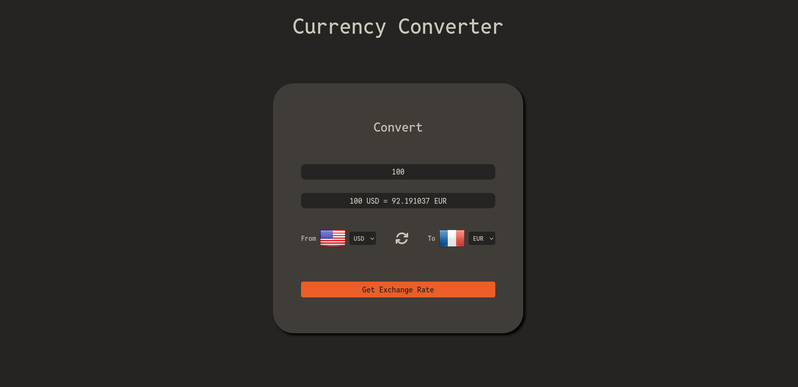

# Currency-Converter

A simple web-based currency converter that allows users to select currencies and get the latest exchange rates. The app uses the Currency API to fetch real-time exchange rate data.

## Features

1. Select currencies from dropdown menus with default selections for USD and EUR.
2. Displays corresponding country flags for selected currencies.
3. Input an amount and convert it to the selected target currency.
4. Shows the conversion result in a user-friendly format.

## Technologies Used

1. HTML
2. CSS
3. JavaScript
4. Currency API

## Usage

1. Open "index.html" in your web browser.
2. Select the currencies you want to convert from and to.
3. Enter the amount you want to convert.
4. Click the "Get Exchange Rate" button to see the conversion result.

## Acknowledgements

1. Currency API for providing free and reliable exchange rate data.
2. Flags API for providing country flags.
